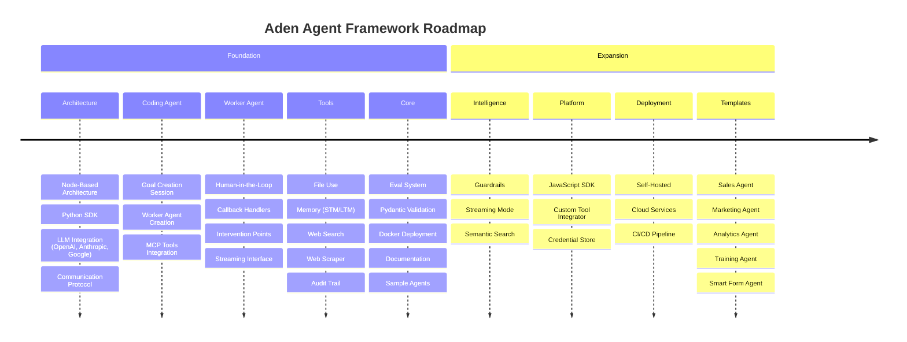

# Product Roadmap

Aden Agent Framework aims to help developers build outcome oriented, self-adaptive agents. Please find our roadmap here

---

## Phase 1: Foundation

### Backbone Architecture
- [ ] **Node-Based Architecture (Agent as a node)**
    - [x] Object schema definition
    - [x] Node wrapper SDK
    - [ ] Shared memory access
    - [ ] Default monitoring hooks
    - [ ] Tool access layer
    - [x] LLM integration layer (Natively supports all mainstream LLMs through LiteLLM)
        - [x] Anthropic
        - [x] OpenAI
        - [x] Google
- [ ] **Communication protocol between nodes**
- [ ] **[Coding Agent] Goal Creation Session** (separate from coding session)
    - [ ] Instruction back and forth
    - [x] Goal Object schema definition
    - [ ] Being able to generate the test cases
    - [ ] Test case validation for worker agent (Outcome driven)
- [ ] **[Coding Agent] Worker Agent Creation**
    - [x] Coding Agent tools
    - [ ] Use Template Agent as a start
    - [x] Use our MCP tools
- [ ] **[Worker Agent] Human-in-the-Loop**
    - [x] Worker Agents request with questions and options
    - [x] Callback Handler System to receive events throughout execution
    - [ ] Tool-Based Intervention Points (tool to pause execution and request human input)
    - [x] Multiple entrypoint for different event source (e.g. Human input, webhook)
    - [ ] Streaming Interface for Real-time Monitoring
    - [ ] Request State Management

### Essential Tools
- [x] **File Use Tool Kit**
- [ ] **Memory Tools**
    - [x] STM Layer Tool (state-based short-term memory)
    - [x] LTM Layer Tool (RLM - long-term memory)
- [ ] **Infrastructure Tools**
    - [x] Runtime Log Tool (logs for coding agent)
    - [ ] Audit Trail Tool (decision timeline generation)
    - [ ] Web Search
    - [ ] Web Scraper
    - [ ] Recipe for "Add your own tools"

### Memory & File System
- [x] DB for long-term persistent memory (Filesystem as durable scratchpad pattern)
- [x] Session Local memory isolation

### Eval System (Basic)
- [x] Test Driven - Run test case for all agent iteration
- [ ] Failure recording mechanism
- [ ] SDK for defining failure conditions
- [ ] Basic observability hooks
- [ ] User-driven log analysis (OSS approach)

### Data Validation
- [ ] Natively Support data validation of LLMs output with Pydantic

### Developer Experience
- [ ] **Debugging mode**
- [ ] **Documentation**
    - [ ] Quick start guide
    - [ ] Goal creation guide
    - [ ] Agent creation guide
    - [ ] GitHub Page setup
    - [ ] README with examples
    - [ ] Contributing guidelines
- [ ] **Distribution**
    - [ ] PyPI package
    - [ ] Docker image on Docker Hub

### Sample Agents
- [ ] Knowledge Agent
- [ ] Blog Writer Agent
- [ ] SDR Agent

---

## Phase 2: Expansion

### Basic Guardrails
- [ ] Support Basic Monitoring from Agent node SDK
- [ ] SDK guardrail implementation (in node)
- [ ] Guardrail type support (Determined Condition as Guardrails)

### Agent Capability
- [ ] Streaming mode support

### Cross-Platform
- [ ] JavaScript / TypeScript Version SDK

### File System Enhancement
- [ ] Semantic Search integration
- [ ] Interactive File System in product (frontend integration)

### More Worker Tools
- [ ] Custom Tool Integrator
- [ ] Integration as a tool (Credential Store & Support)
- [ ] **Core Agent Tools**
    - [ ] Node Discovery Tool (find other agents in the graph)
    - [ ] HITL Tool (pause execution for human approval)
    - [ ] Wake-up Tool (resume agent tasks)

### Deployment (Self-Hosted)
- [ ] Docker container standardization
- [ ] Headless backend execution
- [ ] Exposed API for frontend attachment
- [ ] Local monitoring & observability
- [ ] Basic lifecycle APIs (Start, Stop, Pause, Resume)

### Deployment (Cloud)
- [ ] Cloud Service Options
- [ ] Support deployment to 3rd-party platforms
- [ ] Self-deploy + orchestrator connection
- [ ] **CI/CD Pipeline**
    - [ ] Automated test execution
    - [ ] Agent version control
    - [ ] All tests must pass for deployment

### Developer Experience Enhancement
- [ ] Tool usage documentation
- [ ] Discord Support Channel

### More Agent Templates
- [ ] GTM Sales Agent (workflow)
- [ ] GTM Marketing Agent (workflow)
- [ ] Analytics Agent
- [ ] Training Agent
- [ ] Smart Entry / Form Agent (self-evolution emphasis)
